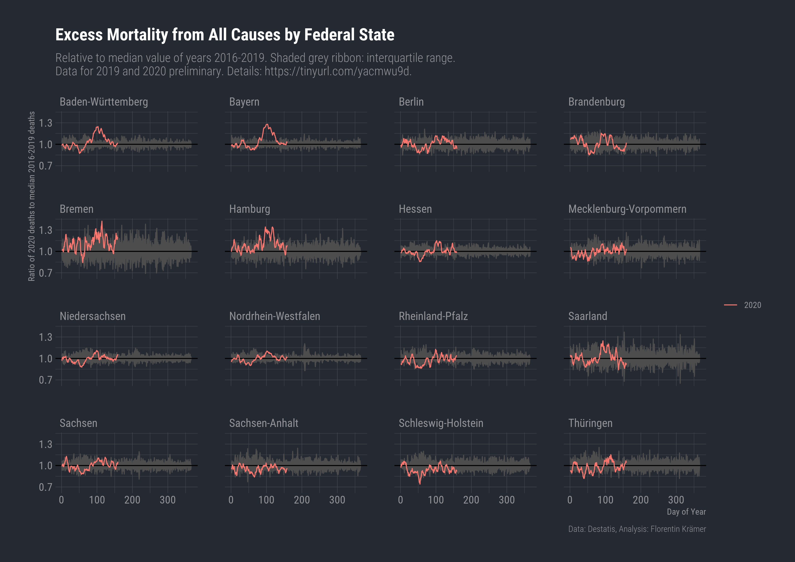
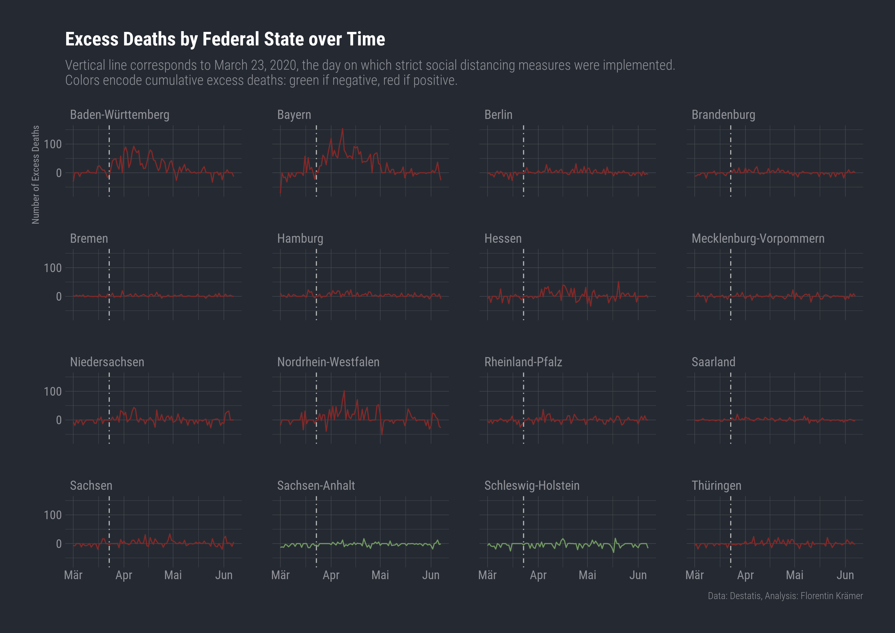
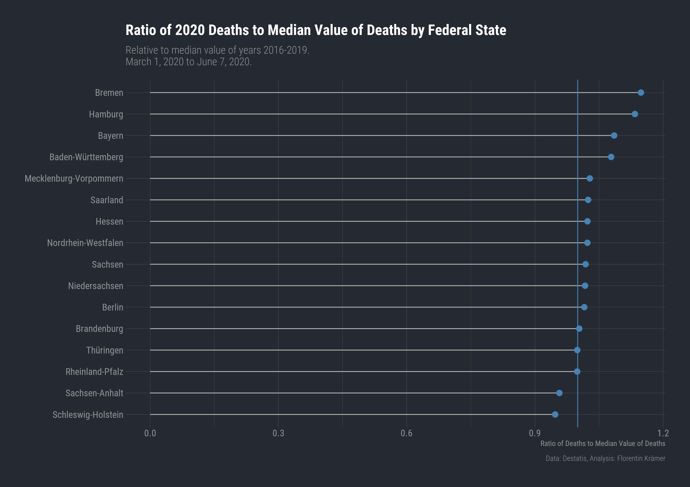
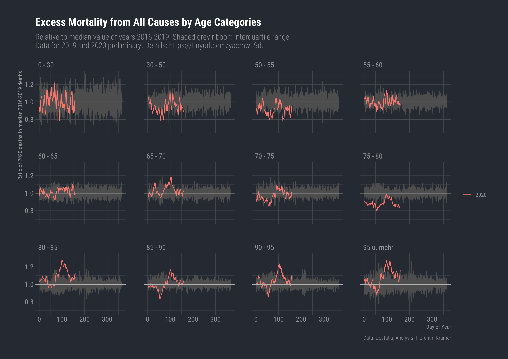
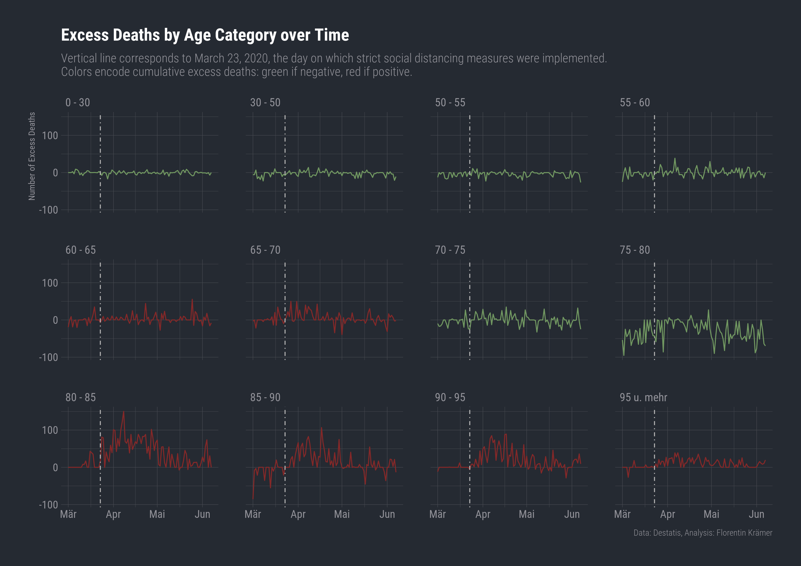
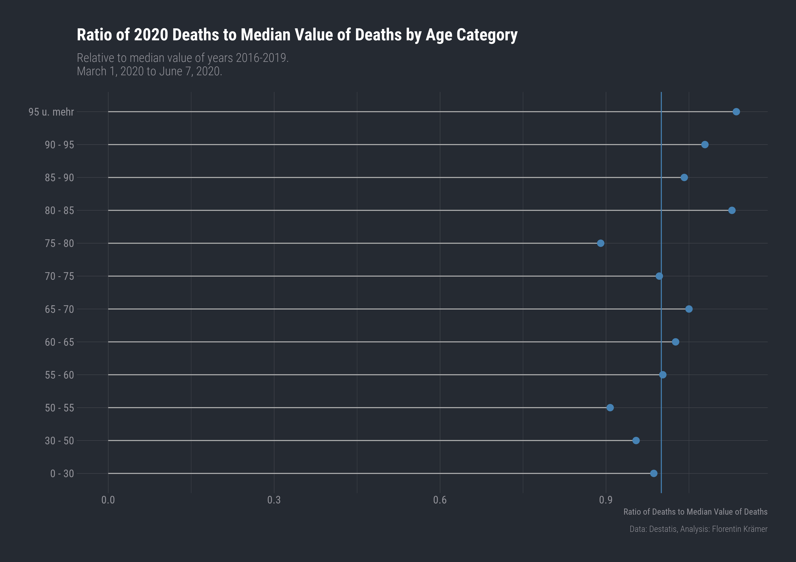

# tidy-mortality

Clean and [tidy mortality data](data/tidy/) (.csv and .rds) for 2016 to 2020 from the Federal Statistical Office of Germany. The original dataset in .xlsx format is available at [this link](https://www.destatis.de/DE/Themen/Gesellschaft-Umwelt/Bevoelkerung/Sterbefaelle-Lebenserwartung/Tabellen/sonderauswertung-sterbefaelle.html?nn=209016). Note that data for 2019 and 2020 are preliminary and have not yet undergone plausibility checks.

I plan to update this repository whenever new data are released. Meanwhile, please feel free to clone or fork the repository. Comments are very welcome!

*Disclaimer*: I do not take responsibility for any errors either in the original dataset or in my cleaned-up version. Use with caution.

# Graphs

The tidied data allow for different decompositions: by *federal state* and by *age group*. The raw dataset also contains mortality data for combinations of broader age groups (0-64 and 65+) and all federal states. In what follows, I first calculate the median number of deaths by federal state/age group for all years prior to 2020 (2016 to 2019). To provide a measure of how spread out these numbers are over the years, I also calculate the interquartile range, i.e. the range between the 25th and 75th percentile. Data for 2020 are then plotted as a right-aligned rolling mean over the previous 7 days.

## By Federal State

### Excess Mortality

Download as [pdf](graphs/excess_mortality_state_median.pdf) or [png](graphs/excess_mortality_state_median.png).

### Cumulative Excess Deaths

The following plot displays the number of deaths from January 1 until April 12, 2020 that can reasonably be considered "out of the ordinary", i.e. that fall outside the interquartile range. Note that we may have both positive and negative excess deaths. The calculation proceeds as follows: daily differences between the 25th percentile and the number of deaths if the number of deaths is below the 25th percentile, resp. daily differences between the 75th percentile and the number of deaths if the number of deaths is above the 75th percentile are plotted as a line. If the number of deaths falls within the interquartile range, excess deaths are recorded as zero. Colors encode cumulative excess deaths, i.e. deaths summed up over the relevant date range.

Download as [pdf](graphs/excess_deaths_time_state.pdf) or [png](graphs/excess_deaths_time_state.png).

### Ratio of Excess Deaths to Median Deaths of Previous Years

The idea of this graph is similar to the above. Instead of reporting absolute numbers, I calculate the ratio of the number of deaths to the median number of deaths in previous years per day and average over the relevant time period.

Download as [pdf](graphs/ratio_excess_mortality_state_median.pdf) or [png](graphs/ratio_excess_mortality_state_median.png).

## By Age Group

### Excess Mortality

Download as [pdf](graphs/excess_mortality_age_median.pdf) or [png](graphs/excess_mortality_age_median.png).

### Cumulative Excess Deaths

The following plot displays the number of deaths from January 1 until April 12, 2020 that can reasonably be considered "out of the ordinary", i.e. that fall outside the interquartile range. Note that we may have both positive and negative excess deaths. The calculation proceeds as follows: daily differences between the 25th percentile and the number of deaths if the number of deaths is below the 25th percentile, resp. daily differences between the 75th percentile and the number of deaths if the number of deaths is above the 75th percentile are plotted as a line. If the number of deaths falls within the interquartile range, excess deaths are recorded as zero. Colors encode cumulative excess deaths, i.e. deaths summed up over the relevant date range.

Download as [pdf](graphs/excess_deaths_time_age.pdf) or [png](graphs/excess_deaths_time_age.png).

### Ratio of Excess Deaths to Median Deaths of Previous Years

The idea of this graph is similar to the above. Instead of reporting absolute numbers, I calculate the ratio of the number of deaths to the median number of deaths in previous years per day and average over the relevant time period.

Download as [pdf](graphs/ratio_excess_mortality_age_median.pdf) or [png](graphs/ratio_excess_mortality_age_median.png).